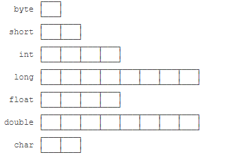

[TOC]

# java简介

c语言、c++语言都是**编译**成二进制文件，由计算机直接执行，称编译型语言。python、ruby等解释型语言由解释器直接加载源码然后运行，而java将源码编译成.class字节码，类似于抽象的CPU指令，针对不同平台编写虚拟机，虚拟机加载字节码并执行，形成一次编写处处运行的效果。

java EE \java SE\java ME即企业版、标准版、micro版

JSR规范\JCP组织\RI参考现实\TCK兼容性测试套件

IDE是集成开发环境：Integrated Development Environment 

三大特征：

* 封装
* 多态
* 继承

Java技术既是编程语言又是平台。Java编程语言是一种高级语言，其特征包含

* 简单Simple
* 面向对象Object oriented
* 分布式Distributed
* 多线程Multithreaded
* 动态Dynamic
* 架构中立Architecture neutral
* 高性能High performance
* 随身携带Portable
* 强大的Robust
* 安全Secure

#### java编程语言

在java编程语言中，首先将所有源代码编写为以.java结尾的纯文本文件，然后由javac编译器编译为.class字节码文件，字节码文件和实际处理器机器语言无关，它是JVM （java虚拟机）的机器语言，然后java启动器工具使用java虚拟机运行程序。JVM可以在不同操作系统上使用，即相同的字节码文件在不同系统的机器上都可以运行。


#### java平台

一个平台是在程序运行的硬件或软件环境，大多数平台可以描述为操作系统和底层硬件的组合，如Microsoft Windows，Linux，Solaris OS和Mac OS，但是java平台是一个基于软件的平台，可以在其它硬件上运行

java平台具有两个组件：

* java虚拟机，是java平台的基础，已经移植到各种基于硬件的平台上
* java应用程序编程接口API，大量现成软件组件的集合，分为相关类和接口的库，这些库称为软件包


作为一个平台独立的环境，Java平台可能比本地代码慢一些。但是，编译器和虚拟机技术的进步使性能接近本机代码，而不会威胁可移植性。

#### java技术可以做什么

通用的高级的java编程语言是一个有力的软件平台，java平台提供以下功能：

* 开发工具：编译、运行、监视、调试和记录应用程序所需的一切工具，主要工具javac编译器、java启动器、javadoc文档工具
* 应用程序编程接口API：提供许多有用的类，涵盖基本对象到网络和安全性、XML生成、数据库访问
* 部署技术：JDK软件提供了标准的机制，例如Java Web Start软件和Java Plug-In软件，用于将应用程序部署到最终用户。
* 用户界面工具包：JavaFX，Swing和Java 2D工具包使创建复杂的图形用户界面（GUI）成为可能。
* 集成库：诸如Java IDL API，JDBC API，Java命名和目录接口（JNDI）API，Java RMI和通过Internet ORB协议技术（Java RMI-IIOP Technology）进行Java远程方法调用的集成库可实现数据库访问和操作远程对象。


# 一、java环境设置

### 1.下载安装JavaJDK

<https://www.oracle.com/technetwork/java/javase/downloads/jdk13-downloads-5672538.html>

jdk是开发工具

jre仅是运行环境

### 2.设置环境变量

JAVA_HOME指向JDK安装目录

classpath指向默认字节码位置，当前位置"."

PATH指向JDK安装目录下的bin目录%JAVA_HOME%\bin;

bin目录下的工具:

* java：即 JVM
* javac：java编译器将.java源文件转化为.class字节码文件
* jar：用于把一类的.class文件打包成一个.jar文件
* jdb：java调试器，用于开发阶段的运行调试

### 3.第一个java程序

```java
public class Hello {
    public static void main(String[] args) {
        System.out.println("Hello, world!");
    }
}
```

一个公开的类叫hello,大小敏感，{}里是类的定义，一个公开的静态方法叫main，()里为方法参数，参数类型String[],参数名args，返回类型为void即空，每行代码；分号结束System类的.out方法的.println方法传入参数“hello，world!”。

一个java源码只能定义一个public类型的class,并且class名要和文件名完全一致。


java文件中有多个类，且没有public类，那么文件名任意，编译的.class文件也对应有多个（JDK8）


main方法是java程序的入口，总是从main方法开始执行代码。

java缩进不是必须的

保存文件名必须和public类名相同，大小写敏感，文件类型.java

```javac  类名.java```

编译，在当前文件夹下生成.class文件

```java 类名```

运行，不需要文件类型后缀

或直接

```java 类名.java```

JVM会自动编译并运行文件

这是Java 11新增的一个功能，它可以直接运行一个单文件源码！

需要注意的是，在实际项目中，单个不依赖第三方库的Java源码是非常罕见的，所以，绝大多数情况下，我们无法直接运行一个Java源码文件，原因是它需要依赖其他的库。


[出现编码GBK不可映射字符](https://jingyan.baidu.com/article/e3c78d649a56233c4c85f502.html)

因为代码中含有中文，包括注释，命令行系统默认编码格式GBK，中文字符代码格式UNICODE或UTF-8

notepad++编译器具有自动转码功能。

为文件指定编码格式

javac -encoding UTF-8 类名.java

[出现需要class,interface、enum](https://blog.csdn.net/a66731167/article/details/81286537)


重新保存文件，编码格式改为ANSI

# 二、面向对象的编程概念

## 1.什么是对象Object

对象是具有相关状态和行为的软件包。将对象的状态存储在字段（变量）中，通过方法（函数）公开其行为。方法在对象内部状态上运行，并用作对象间通信的主要机制，隐藏内部状态并要求通过对象的方法执行所有交互称为数据封装-面向对象编程的基本原理。

面向对象的优点：

* 模块化：可以独立于其他对象源代码编写和维护对象的源代码，创建对象后，可以轻松在系统内部传递对象
* 信息隐藏：仅通过与对象的方法进行交互，其内部实现的细节对外界隐藏
* 代码重用：如果某个对象已经存在，则在程序中可以使用该对象，可以是其他人员编写的对象。
* 可插拔性和调试简便性：如果发现对象出错，只需删除该对象代码，插入另一个对象作为替换对象即可

## 2.什么是类Class

java是面向对象的语言，一个程序的基本单位是类，类是从中创建对象的蓝图或原型

## 3.什么是继承Inheritance

继承为组织和构造软件提供了强大而自然的机制，不同种类的对象有一定的相同点，面向对象的编程允许类从其他类继承常用的状态和行为。

创建子类在类声明的开头使用extends关键字，后跟继承的类的名称，可以使子类代码易读，但是必须记录超类的状态和行为，超类的代码不会出现在子类的源文件中。

## 4.什么是接口Interface

接口是类与外界之间的契约，当一个类实现一个接口时，承诺提供该接口的发布行为。对象通过其公开的方法定义了与外界的交互，方法形成对象与外界的接口，接口是一组具有空主体的相关方法。实现一个接口可时类对其承诺提供的方法变得更加正式。接口在类和外部之间形成契约，该契约在编译时由编译器强制执行，如果类要实现一个接口，在成功编译该类前，该接口定义的所有方法必须出现在其源代码中。接口中的方法默认都是public和abstract的。所以在实现接口的类中，实现方法时都要在方法前加上“public”修饰符。

## 5.什么是包Package

包是用于以逻辑方式组织类和接口的命名空间，将代码放入包中使程序有利于管理。

# 三、java语言基础Language Basics

## 1.标识符

* 用户可以起名的标识，如类名，变量名、方法名、接口名、包名
* 英文字母、$美元符号、_下划线开头，加上数字可以作为标识符的元素，但是数字不能作为标识符开头
* 区分大小写、无限长度的unicode编码，使用完整的单词，而不要使用隐含的缩写
* java关键字、保留字即不能用作标识符，类名、接口名使用驼峰式写法，普通变量和方法名使用小驼峰式写法、常量全大写、包名字母都小写（建议规范：命名不遵守规范编译可以通过）
* 必须先声明变量后使用，有垃圾回收机制。

## 2.关键字与保留字

* Java使用关键字标识功能，产生语法语义。  

* 关键字不做变量名、类名、方法名。

* 关键字中所有字母都是小写。

关键字keyword：

**abstract	class extends	implement	null	strictfp	true	assert	const		false	import	package	super	 try	boolean	continue	final	instanceof	private	switch	void	break	default	finally	int	protected	synchronized	volatile	byte	do	float	interface	public	this	while	case	double	for	long	return	throw	catch	else	goto	native	short	throws	char	enum	if	new	static	transient**

保留字reservedword：

**goto	const**

数据类型：class	interface	enum	byte	short	int	long	float	double	char	boolean	void

流程控制：if	else	switch	case	default	while	do	for	break	continue	return

访问权限修饰符：private	protected	public

类、变量、方法修饰符：abstract	final	static	synchronized

类与类关系：extends	implements

实例、引用、判断实例：new	this	super	instanceof

异常处理：try	catch	finally	throw	throws

包：package	import

其他修饰符：native	strictfp	transient	volatile	assert

数据类型值字面值：true	false	null

var关键字

## 3.变量Variables

* 对象状态存储在字段当中，对象行为存储在方法当中。
* 变量本质上是内存的一块空间，还具有可见性/生存周期。变量包含数据类型、名称、字面值。  
* 所有变量必须具有类型。
* 数据类型分两种，相应的java变量分两种，基本类型变量+引用类型变量
* 变量的类型决定了变量可能的取值范围和可能执行的操作。
* 编译器会赋初值，但是不会为局部变量赋初始值。
* 字面值的数据类型要和变量的数据类型一致。  
* 变量的值可以修改多次。而变量的空间大小的不变的，空间位置改变，即修改了引用的指针。  
* 变量需要赋值才能使用，声明变量本质只是生成了引用标签，空间未申请，赋值后才实际申请了空间。
* 变量作用域最小化{}，减少重名变量。
* 给变量赋值时jvm给新值一个空间并将变量标签重新指向新变量空间，不是将旧变量空间替换值。
* 允许创建赋值链
* 允许动态初始化
* 方法局部变量：在方法体内定义的变量或方法参数内定义的，不能使用访问修饰符，可以使用final
* 形参调用时赋值，方法体内局部变量可以赋初值，没有默认值
* 变量的作用域之内必须唯一，不同作用域可以有相同变量名
* 定义创建了变量，并为其分配内存；声明没有分配内存。
* 一个变量在一定的区域内只能被定义一次，却可以被多次声明。
* 基本变量存储在栈空间中，先入后出FILO,小快，引用变量存储在堆空间中，大慢

java编程语言定义了以下种类的变量：

* **实例变量**（非静态字段）**Instance Variables (Non-Static Fields)** 从技术上讲，对象将其各自的状态存储在非静态字段中，即声明为不使用static关键字的字段，非静态字段也称为实例变量，因为实例变量的值对于每个类的每个实例（对象）都是唯一的。
* **类变量**（静态字段）**Class Variables (Static Fields)**是由*static*修饰的变量，无论该变量实例化了多少次，该变量存在一个副本。
* **局部变量** **Local Variables**与对象在字段中存状态相似，方法将临时状态存储在局部变量中。声明局部变量的语法类似于声明字段，没有特殊的关键字将变量指定为局部变量，该确定完全来自声明变量的位置，该位置在方法的左括号和右括号之间。因此局部变量仅对声明它们的方法可见，在类中的其他方法或变量无法访问它们。大括号
* **参数** **Parameters**是为方法提供额外信息的变量，被分类为变量而不是字段，在方法签名的参数列表中。小括号

java编程语言**变量**的命名规则和约定：

* 变量名称区分大小写，变量的名称可以是任何合法的标识符-无限长度的*unicode*字母和数字序列，以字母、美元符号￥、下划线\_开头。但是约定变量名始终以字母开头，而不是美元符号￥或下划线\_字符，惯例完全不使用美元符号￥，不允许使用空格。
* 后续字符可以是字母、数字，美元符号￥下划线_字符。为变量选择名称时，应使用完整的单词而不使用隐晦的缩写。
* 仅含一个单词的变量名应全部小写，包含多个单词的变量名首单词小写后续大写每个单词的第一个字母（**小驼峰写法**），如果变量是常量则将每个字母大写并用下划线分隔后续单词。

### 基本数据类型Primitive Data Types

java编程语言是静态类型的，必须先声明所有变量后使用。变量的数据类型决定了字段值的范围以及可能的操作。java有八种基本数据类型，由语言预先定义并由由关键字命名，基本值不与其它基本值共享状态。基本数据类型是CPU可以直接进行运算的类型。八种基本数据类型是：

* **byte**:byte数据类型是8位带符号的二进制补码整数，最小值为-128，最大值为127。
* **short**:short数据类型是16位带符号的二进制补码整数。最小值为-32768，最大值为32767。
* **int**:int数据类型默认情况下是32位带符号的二进制补码整数。可以使用Integer类静态方法compareUnsigned、divideUnsigned等将int数据类型表示无符号的32位整数进行运算。
* **long**:long数据类型是64位二进制补码整数。可以使用Long类静态方法compareUnsigned、divideUnsigned等将int数据类型表示无符号的64位整数进行运算。
* **float**:float数据类型是单精度32位IEEE 754浮点数。
* **double**:double数据类型是双精度64位IEEE 754浮点数。
* **char**:chart数据类型是单个16位Unicode字符。最小值为\u0000即0，最大值为\uffff 65535
* **boolean**:boolean数据类型只有两个可能的值：true和false。



在java.lang.String类为字符串提供特殊支持，用双引号扩住字符串会自动创建一个新String对象，String对象是不可变的，意味着对象一旦创建就无法更改，该类不是基本数据类型。

引用数据类型：

* 类class
* 接口interface
* 数组
* srting

枚举类型

不同数据类型可以指示编译器申请空间和限制变量的类型。  

### 自动类型转换（自动类型提升）

不包含boolean类型的基本类型之间的运算

小范围向大范围类型自动转换，范围大的类型空间不一定大。

byte,short,char>int>long>float>double

char与short运算结果为int类型

char与byte运算结果为int类型

byte与short运算结果为int类型

char\byte\short相互运算或自己运算都使用int类型,整型常量默认类型int,浮点型默认类型double

### 字面值Literals

初始化基本数据类型的变量未使用*new*关键字，基本数据类型是语言中内置的特殊数据类型，基本数据类型不是从类中创建的对象。字面值是固定值的源代码表示，直接在代码中表示，无需计算，可以将字面值分配给基本数据类型。

boolean result = **true**;	byte b = **100**;	char c = **'c'**;	int hexVal = **0x1a**;	 int binVal = **0b11010**;	

double d2 = **1.234e2**;(科学计数法)	float f1  = **123.4f**;

* 二进制字面值：前缀 0b 表示二进制数

* 十六进制字面值：前缀 0x 表示十六进制数

* 整数字面值：整数字面量末尾带L或 l 则为long型字面量，否则为int型字面量，建议使用大写L（l与1相似）。整数类型byte、short、int、long赋值可以用int字面值，long类型超过int的范围的值可以用long字面值。整数字面值可以使用二进制Binary、十进制Decimal和十六进制Hexadecimal

* 浮点字面值：浮点字面值以F或f作后缀，否则为double类型，并且可以选择D或d结尾。

* 字符char和字符串String字面值：字符和字符串可以使用任何Unicode字符，包括Unicode转义字符，char字面值使用单引号‘ ’，String字面值使用双引号“ ”。

如果含许多数字可以使用下划线_分隔数字以分组，提高代码的可读性

正确使用只能在数字之间分隔：

long number = 1234_5678_9012_3456L;

float pi =  3.14_15F;

long hex = 0xFF_EC_DE_5E;

byte b= 0b0010_0101;

int x = 5_______2;

int x= 0x5_2; 


错误使用：

* 在数字的开头或结尾：int x = 52_;   int x= 0x_52;      int x = 0_x52;      int x = 0x52_;
* 与浮点小数点相邻：float pi = 3_.1415F;   float pi = 3._1415F;   
* 在F或f之前：long x = 999_99_9999_L;
* 在字符串的数字当中需要连续的数字时：String x = "123_465"

### 常量constant value

int MAX_X =100;需要的值是基本不会变，变量名使用全大写，用下划线分隔每个字母，可以使用final保证值不变。 

### 默认值Default Values

声明字段时，不一定总是需要分配值，编译器会将已声明但未初始化的字段设置合理的默认值。一般来说默认值将为零或null

**byte:0	short:0	int:0	long:0L	float:0.0f	double:0.0d	char:'\u0000'	String(or any object):null	boolean:false**

编译器不会将默认值分配给未初始化的局部变量，访问未初始化的局部变量将导致编译时错误。

### 数组Arrays

 数组是单一类型的值的固定数量的容器对象。数组类型 **type []**和数组名，创建数组时确定数组的长度n，创建之后数组长度不可变。数组的元素通过数组下标引用 ，从0开始到n-1。声明数组并不创建数组，只是告诉编译器该变量将保存指定类型的数组。中括号[]也可以放在数组名后面声明，但是不建议。

声明整型数组： int [] anArray; 

分配数组相应的内存空间：   anArray = new int [10];  或  int [] anArray = {1,2,5,9};  使用逗号隔开元素 

多维数组：String  \[]\[] names  = {  {"abc","def"},{"gh","ij"},{"k"}  }

使用**数组名.length**确定数组长度。

复制数组使用System.arraycopy(copyfrom,posfrom,copyto,posto,length)

或者type [] arr=java.util.Arrays.copyOfRange(copyfrom,start,end)

## 4.运算符Operators

运算符是特殊的符合，可对一个两个或三个操作数执行运算并返回结果，下表运算符按优先级顺序排出，优先级越高越靠近顶部，同一行优先级相同，除了赋值运算符**=**之外所有二元运算符从左向右求值，赋值运算符从右向左求值，三元运算符只有**？=**从左向右运算。

|                            运算符 | 优先顺序                                            |
| --------------------------------: | :-------------------------------------------------- |
|                 后缀运算符postfix | `expr++  expr--`                                    |
| 一元运算符unary，前缀运算符profix | `++expr  --expr  +expr  -expr  ~  !`                |
|                乘法multiplicative | `*  /  %`                                           |
|                      加法additive | `+  -`                                              |
|                         位移shift | `<<  >>  >>>`                                       |
|                    关系relational | `< >  <=  >=  instanceof`                           |
|                      相等equality | `== !=`                                             |
|                 按位与bitwise AND | `&`                                                 |
|      按位异或bitwise exclusive OR | ^                                                   |
|        按位或bitwise inclusive OR | `|`                                                 |
|                 逻辑与logical AND | `&&`                                                |
|                  逻辑或logical OR | `||`                                                |
|                 三元运算符ternary | `? :`                                               |
|                    分配assignment | `=  +=  -=  *=  /=  %=  &=  ^=  |=  <<=  >>=  >>>=` |


### 赋值、算术和一元运算符

* 赋值运算符：**=**将右边的式子结果赋值给左边的变量。 还可以用于对象的引用赋值给实例化对象

* 算术运算符 ：**+  -  *  /  %**，其中+还可以做字符串的连接
* 一元运算符：正**+**， 负**-**，自增**++**，自减**--**，逻辑非**！**，

### 相等、关系和条件运算符

* 相等、关系运算符：等于**==**、不等于 **!=**、大于**>**、大于或等于 **>=**、小于**<**、小于或等于 **<=**

* 条件运算符：短路与 **&& **、短路或 **||**，加上三元运算符**？：**在进行布尔表达式运算时具有短路行为。 

* 类型比较运算符：instanceof运算符将特定类型和对象进行比较，可以比较对象是否是实现特定接口的类的实例，子类的实例还是类的实例。

### 按位和移位运算符

* 一元补码运算符：**~**，将二进制的0和1转换。
* 有符号的位移运算符：左移运算符   **<<**   右移运算符  **>>**，被位移数在运算符左侧，位移量在右侧给出称右操作数，必须是非负值，左移空出用0填补，右移高位补符号位，高位左移舍弃高位，低位右移舍弃低位，符号位不参与位移。无符号位移运算符**>>>**低位舍弃高位补0
* 按位与运算符：**&**
* 按位或运算符：**|**
* 按位异或运算符：**^**

## 5.表达式、语句和块Expressions, Statements, and Blocks

运算符可以构建表达式，表达式可以计算值，表达式是语句的核心组成部分，多个语句可以组合分为一个或多个块。

* 表达式：表达式的结果为单个值，值的类型取决于表达式中使用的元素。表达式可以复合嵌套，只要满足返回类型是需要的类型即可。可分为赋值表达式、自增自减表达式、方法调用、对象创建表达式。如：a++、add(a,b)、new String、a=10
* 语句：一条语句构成完整的执行单元，以分号**；**结束语句。使用表达式的语句称为表达式语句，还有声明语句和控制流语句。如：double aValue；
* 块：块是一组大括号braces 之间零或多条语句构造的语句集合


## 6.控制流语句Control Flow Statements

源文件中的语句通常按显示顺序从上到下执行，控制流语句通过决策、循环和分支来分解执行流，使有条件的执行代码

#### if-then和if-then-else语句

if条件判断语句只有在条件判断为true时才执行if语句块，如果条件判断为false则执行下一个语句块。if判断语句对应的只有一条执行语句时可以省略一对大括号{}，但是会降低易读性，多条执行语句不可以省略大括号{}。

if(条件判断){

执行语句块

}


if(条件判断){

执行语句块1

}else {

执行语句块2

}

可以设置多层条件判断：

if(条件判断1){

执行语句块1

}else if(条件判断2){

执行语句块2

}else {

执行语句块3

}

#### switch语句

switch语句可以具有多条执行语句路径，值可以是char、byte、short、int、枚举类型、String以及一些包装了基本类型chat、byte、short、int的特殊类。不使用float、double、boolean类型的数据。if 语句可以基于值或者条件的范围判断表达式，而switch只能基于单个值、枚举类型和String对象判断表达式。匹配的case之后若无break语句，则执行下一条case，直到遇到break终止switch语句或者switch语句块执行完为止。String对象的case比较相当于使用String.equals()方法，可以使用toLowerCase()方法使字符都小写以完成匹配。

switch(值){

case 值1:语句1；

break;

case 值2:语句2；

break;

default:语句3；

break；

}

#### while和do-while语句

while可以提供连续执行语句块，条件判断为true时执行语句块，执行完语句块后再进行条件判断，可以先判断后执行while，或先执行后判断do-while。需要设置条件出口，否则程序进入死循环。  

while(条件判断){

执行语句块

}

do{

执行语句块

}while(条件判断)

#### for语句

for语句提供一种紧凑的方法来迭代一系列值。

* 初始化表达式（初始化条件）启动循环，只执行一次。
* 条件判断为true则进入执行语句块
* 执行语句块后执行条件改变语句，再进行条件判断，条件为false则退出循环。

for(初始化条件1；条件判断2；条件改变4){

执行语句块3

}

通过集合和数组的迭代形式

for(局部变量：数组或集合){

执行语句块

}

#### 分支语句break、continue、return

**break**有两种形式：labeled 和unlabeled，unlabeled break用在switch语句、for循环语句、while语句、do-while语句。break跳出的循环或分支是嵌套分支、嵌套循环的最内层循环或分支语句。

> An unlabeled break statement terminates the ` innermost` switch, for, while, or do-while statement, but a labeled break terminates an outer statement.

labeled  break与c语言goto语句不同，尽管都是跳转到标签位置，但是goto语句是跳转到标签位置并且执行标签之后的语句，而labeled  break跳转到的标签必须是labeled  break所在的任何一层循环。而不能随意跳转，而且跳转到的标签之后的循环停止执行该循环。

> The `break` statement terminates the labeled statement; it does not transfer the flow of control to the label. Control flow is transferred to the statement immediately following the labeled (terminated) statement.

> 可以`xxx`用`first`或替换`second`（以中断外部或内部循环），若为`first`则整个循环停止，若为`second`则停止内部循环，外部循环依旧执行，当运行到该`break`语句时，两个循环都正在执行，但是替换`xxx`为`third`将无法编译。

```
first:
for( int i = 0; i < 10; i++) {
  second:
  for(int j = 0; j < 5; j ++ )
  {
    break xxx;
  }
}

third:
for( int a = 0; a < 10; a++) {

}
```

**continue**也有labeled  continue和unlabeled continue，unlabeled continue跳过内层的一次循环，可认为该语句是执行到本次循环的最后语句，适用for语句、while语句、do-while语句。

> A labeled `continue` statement skips the current iteration of an outer loop marked with the given label

**return**从当前方法当中返回值并退出该方法，可以带值返回或不带值的返回void，返回值的类型必须与方法声明的返回值类型匹配。

### 15.静态字段与静态方法

对于静态字段，无论修改哪个实例的静态字段，效果都是一样的：所有实例的静态字段都被修改了，原因是静态字段并不属于实例：

虽然实例可以访问静态字段，但是它们指向的其实都是`Person class`的静态字段。所以，所有实例共享一个静态字段。不建议这样做，因为并不能明确表明它们是类变量

因此，不推荐用`实例变量.静态字段`去访问静态字段，因为在Java程序中，实例对象并没有静态字段。在代码中，实例对象能访问静态字段只是因为编译器可以根据实例类型自动转换为`类名.静态字段`来访问静态对象。

推荐用类名来访问静态字段。可以把静态字段理解为描述`class`本身的字段（非实例字段）。

有静态字段，就有静态方法。用`static`修饰的方法称为静态方法。

调用实例方法必须通过一个实例变量，而调用静态方法则不需要实例变量，通过类名就可以调用。静态方法类似其它编程语言的函数。可以使用对象引用来引用静态方法

静态方法属于`class`而不属于实例

静态方法内部，无法访问`this`变量，也无法访问实例字段，它只能访问静态字段。

因为`interface`是一个纯抽象类，所以它不能定义实例字段。但是，`interface`是可以有静态字段的，并且静态字段必须为`final`类型：

- 静态字段属于所有实例“共享”的字段，实际上是属于`class`的字段；
- 调用静态方法不需要实例，无法访问`this`，但可以访问静态字段和其他静态方法；
- 静态方法常用于工具类和辅助方法。

包没有父子关系。java.util和java.util.zip是不同的包，两者没有任何继承关系。

静态成员会在加载类时初始化，在内存创建，而非静态成员则是在创建实例时初始化，在内存创建。所以没有实例的情况下也可以访问静态成员，只要加载了所在的类。

# 四、类和对象

类声明为类命名，并将类主体括在大括号之间。类名之前可以有修饰符。类主体包含该类的字段，方法和构造函数。一个类使用字段来包含状态信息，并使用方法来实现行为。初始化类的新实例的构造函数使用类的名称，并且看起来像没有返回类型的方法。

您可以通过相同的方式控制对类和成员的访问：通过使用访问修饰符（例如`public`在其声明中）。

您可以使用`static`成员声明中的关键字来指定类变量或类方法。未声明为`static`的成员为实例成员。类变量由类的所有实例共享，并且可以通过类名称以及实例引用进行访问。类的实例获得每个实例变量的自己的副本，必须通过实例引用对其进行访问。

您可以通过使用`new`运算符和构造函数从类创建对象。new运算符返回对创建的对象的引用。您可以将引用分配给变量或直接使用它。

垃圾收集器会自动清除未使用的对象。如果程序不再保存对该对象的引用，则该对象未使用。您可以通过将保存引用的变量设置为`null`来显式删除引用。

## 1.类Classes

* 类本身就是一种数据类型

* 类可以有多个字段、多个构造器、多个方法
* 在面向对象OOP的术语中，把extends后的类称为超类（super class），父类（parent class），基类（base class），把extends前的类称为子类（subclass），扩展类（extended class）。

### 声明类Declaring Classes

* 类的声明/定义使用class关键字。字段、构造器和方法在类的主体内用大括号{}包含。用于提供从类中创建对象的生命周期的代码。类名首字母大写（大驼峰写法）。
* 字段提供类和对象的状态
* 构造器用来初始化新的对象
* 方法实现类和对象的行为
* 可以使用修饰符修饰类、字段、构造器和方法
* 使用extends关键字继承父类，一个类只能继承一个父类
* 使用implements关键字实现接口，一个类可以实现多个接口

```
class name extends superclass implements interface{

字段field

构造器constructor

方法method

}
```

大括号的使用有两种形式，编译器都支持，可以使用在类的声明，方法的声明、构造器的声明、循环分支语句。

* 行尾风格

a{

}

* 次行风格

a

{

}

### 声明成员变量Declaring Member Variables

变量：类中的成员变量称为字段*fields*，包括静态字段（类变量）和非静态字段（实例变量），方法或代码块block 中的变量称为局部变量 *local variables*.，方法声明method declarations中的变量称为参数*parameters*

字段声明：包括零个或多个修饰符，字段的类型和字段的名称

访问修饰符：可以修饰类之间的访问控制，修饰类中的字段和方法的访问控制，写在在最左侧的位置。public修饰符可以从所有类访问该字段或方法，private修饰符表示该字段或方法只能在本类中访问。通常将字段设为私有，通过公开的方法进行间接访问或修改。

类型：所有的变量都必须具有类型及相应的空间，可以使用基本数据类型或引用数据类型。

```
int a;	String b;	float c;
```

### 定义方法Defining Methods

* 声明方法中必须的元素是返回类型、方法名、小括号(零个或多个参数列表，使用逗号隔开参数)、大括号{局部变量的声明和执行的代码}
* 如果尝试从声明的方法返回值`void`，则会出现编译器错误。
* 方法名使用小驼峰写法，首字母应是动词。
* 方法签名：由方法的名称和参数类型组成，如：computeAnswer（double，int，double）
* 方法在类中具有唯一的名字，**方法重载**可以使方法与类中的其它方法名重名，不同类的方法名不会冲突。
* 类中的方法具有不同的参数列表（不同的方法签名）则他们可以具有相同的方法名，包括参数类型、参数数量、参数类型顺序不同
* 编译器不考虑返回类型和修饰符，因此两个方法具有不同的返回类型，无法声明具有相同签名的两个方法。相同方法签名的方法使用不同参数名也不能通过编译。
* 返回值的数据类型必须与方法声明的返回类型相匹配
* 可以使用任何数据类型作为方法和构造函数的参数，包括原始数据类型和引用数据类型（数组，对象）
* 参数数量可以无限，当不确定使用多少参数时可以使用*varargs*的构造方式，在最后的参数类型上加上...三个点和参数名，就可以使用该参数0个到无限个。方法内部将该参数视为数组，用数组下标调用传入的参数。
* 调用方法或重写方法overload时，使用的参数必须在类型和顺序上与声明的参数匹配。
* 要将方法传递给方法，请使用 [lambda表达式](https://docs.oracle.com/javase/tutorial/java/javaOO/lambdaexpressions.html)或 [方法引用](https://docs.oracle.com/javase/tutorial/java/javaOO/methodreferences.html)。
* 参数名称在范围内是唯一的，它不能与相同方法或构造函数的另一个参数的名称相同，也不能与方法或构造函数中的局部变量的名称相同，参数可以与类的字段之一具有相同的名称
* 传递基本数据类型的值
* 传递引用数据类型的引用

> *Parameters* refers to the list of variables in a method declaration. *Arguments* are the actual values that are passed in when the method is invoked.

形式参数指声明方法中的变量列表，实际参数是调用方法传递的实际变量或字面量

```
public double calculateAnswer(double wingSpan, int numberOfEngines,double length){
    //do the calculation here
}
public double calculateAnswer(double wingSpan){
    //do the calculation here
}
public double calculateAnswer(){
    //do the calculation here
}
```

### 构造函数Constructors

* 一个类必须包含构造函数，构造函数在创建对象时调用类的构造函数
* 默认构造函数是父类的构造函数，若父类无显式声明构造函数则编译失败，默认的类都是object类的子类，包含一个无参的构造函数。可以调用父类的构造函数。
* 构造函数类似方法声明，使用类的名称且没有返回类型。
* 构造函数也可以使用重载方法，即一个类中可以使用多个构造函数，根据创建对象时传入的参数类型和数量调用相应的构造函数
* 构造函数可以使用访问修饰符
* 子类默认的构造方法是编译器自动生成的，不是继承的
* 创建对象初始化顺序：静态字段》非静态字段》构造器初始化

## 2.对象Objects

* new操作会调用类的构造函数，且构造函数不能像其他方法调用，只能使用new关键词。

* new返回的值来访问新对象的字段，随即丢失新对象的引用，int a =new 类名.字段；也可以访问引用对象的方法

* 对象引用来调用对象的方法 类名.方法名(参数列表)；

* `new`运算符返回的引用不必分配给变量。也可以直接在表达式中使用

  ```
  int height = new Rectangle().height;
  ```

### 创建对象

* 声明**Declaration**=类型+变量名/对象名

* 实例化**Instantiation**=new +类，新建对象。调用无参构造函数

* 初始化**Initialization**=new +类（值），赋初值，调用含参构造函数

声明变量以引用对象，声明**引用变量**不会创建对象，

### 使用对象

* 使用点.运算符访问对象的字段和方法

* 访问对象的字段
* 访问对象的方法,如果是无参方法也要使用小括号（）
* 可以通过将变量设置为特殊值`null`来显式删除对象引用
* 一个程序可以对同一个对象有多个引用。在对象有资格进行垃圾回收之前，必须删除对对象的所有引用。

### 从方法返回值

* java参数传递机制：值传递

* 基本数据类型传递值，引用数据类型传递地址
*  声明为void类型的方法不返回值。可以不包含一个`return`语句。声明为其它类型的方法必须返回相应类型的语句
* 从声明为void的方法返回值，则会出现编译器错误
* 返回值的数据类型必须与方法声明的返回类型相匹配

### 从方法返回对象和接口

* 一个方法返回类时，该类必须是返回类型的子类subclass，或者是该返回类型的确切类exact class

### this关键字

* 实例方法 instance method或构造函数constructor中，this关键字是对当前对象 *current object* 的引用reference ，当前对象将被调用其方法或构造函数

* 类包含一组构造函数。每个构造函数都会初始化矩形的一些或所有成员变量。构造函数为参数未提供其初始值的任何成员变量提供默认值

  >  Each argument to the constructor shadows one of the object's fields

```
 public Point(int x, int y) {//类的方法参数变量使用类的字段同名变量
        this.x = x;
        this.y = y;
 }
```

* 构造函数中可以调用同一类中的另一个构造函数，称为显示构造函数调用
* 则另一个构造函数的调用必须是该构造函数的第一行

```
public class Rectangle {
    private int x, y;
    private int width, height;
        
    public Rectangle() {
        this(0, 0, 1, 1);
    }
    public Rectangle(int width, int height) {
        this(0, 0, width, height);
    }
    public Rectangle(int x, int y, int width, int height) {
        this.x = x;
        this.y = y;
        this.width = width;
        this.height = height;
    }
    ...
}
```

### 访问控制Controlling Access

* 访问修饰符确定其他类是否可以访问一个类的字段和方法
* 访问控制只是对其他类来说，不是对被修饰的类或成员变量。
* 类始终有权访问其自己的成员

访问控制分为两个级别：**At the top level**和**At the member level**

At the top level：类的权限修饰符有两个：`public`, or *package-private* (no explicit modifier).

*   当一个类申明为public时，它对任何地方的类都是可见的。
*   当一个类没有申明权限时，即默认设为package-private,它只对在自己的包内的所有类可见。

At the member level：类中成员的权限修饰符有：`public`, `private`, `protected`, or *package-private* (no explicit modifier).

*   当成员申明为public时，它对任何地方的类都是可见的。
*   当成员没有申明权限时，即默认设为package-private,它只对在自己的包内的所有类可见。
*   当成员申明为private时，它只对本类是可见的。
*   当成员申明为protected时，除了对自己所在的包内所有类是可见的还对其他包内的本类的子类是可见的。

### 类成员Class Members

`static`关键字来创建属于该类而不是该类实例的字段和方法，称静态方法以及静态变量，又称类变量和类方法。

static关键字可以和final关键字一起使用。

#### 类变量

* 从同一类创建对象有各自的实例变量副本，存储在不同的位置，类变量（静态变量）允许所有对象共享一个变量，使得对象可以读取相同的值，该变量只有一个副本，任何该类的实例（对象）都可以访问和修改类变量，一个类可以有多个类变量。

#### 类方法

静态方法`static`的声明中带有修饰符，应使用类名调用它们，而无需创建该类的实例，

```
ClassName.methodName（args）
```

还可以使用对象引用来引用静态方法，但不建议使用

```
instanceName.methodName（args）
```

- 实例方法可以直接访问实例变量和实例方法。
- 实例方法可以直接访问类变量和类方法。
- 类方法可以直接访问类变量和类方法。
- 类方法**不能直接**访问实例变量或实例方法，它们必须使用对象引用。同样，类方法不能使用`this`关键字，因为没有实例可供`this`引用。

### 初始化字段Initializing Fields

* 声明中为字段提供初始值
* 实例变量可以在构造函数中初始化
* 静态初始化块：static{ }一个类可以有不限数量的静态初始块定义在类的任何地方，运行时系统保证静态初始化块按在源代码中出现的顺序被调用
* 可以将静态初始快写成私有的静态方法，私有静态方法的优点是需要重新初始化类变量时可以调用该静态方法
* 可以在构造器中初始化实例变量，有两种方法：初始块和final方法，
* 初始块{}和静态初始块static{}的区别是没有static关键字，java编译器将初始块赋值到每个构造器中，该方法可以在多个构造器之间共享代码
* final方法不能在子类当中被复写，class a{final fun()}

## 3.嵌套类Nested Classes

在另一个类中定义一个类,这样的类称为*嵌套类*， 嵌套类分为两类：静态和非静态。声明`static`的*嵌套类*称为*静态嵌套类*。非静态嵌套类称为*内部类*。嵌套类可以使用public、private、protected、*package private*（默认）修饰符，而外部类只能使用public或*package private*修饰符。

> A nested class is a member of its enclosing class. Non-static nested classes (inner classes) have access to other members of the enclosing class, even if they are declared private. Static nested classes do not have access to other members of the enclosing class 
>
> 嵌套类是封闭类enclosing class的成员，非静态嵌套类（内部类）可以访问封闭类的成员，即使封闭类成员声明为private，静态嵌套类不能访问封闭类的其它成员

```
class OuterClass {//外部类
    ...
    class NestedClass {//内部类
        ...
    }
    class static NestedClass {//静态嵌套类
       ...
    }
}
```

使用嵌套类的优点：

* 是一种对仅在一个地方使用的类进行逻辑分组的方法：如果B类仅对另一个A类有用，则将B类嵌入到A类保持两者是合乎逻辑的，嵌套B类到A类中可以使包更加简单。
* 增加封装性：两个顶级类A和B，B需要访问A的声明为private的成员，普通的类将不能访问到该类的private成员，可以通过将B类嵌入到A类中，则B类可以访问到A类的private成员，除此之外，B类可以对外界隐藏。
* 增加代码可读性和维护性：在顶级类中嵌套**嵌套类**将会使嵌套类的代码靠近使用嵌套类的类

### 静态嵌套类*static nested classes*

与类变量和类方法一样，静态嵌套类与其外部类相关联。

与静态方法（类方法）一样，静态嵌套类不能直接引用其封闭类中定义的实例变量或方法，只能通过对象引用来使用实例变量和方法。

静态嵌套类与其外部类的实例成员进行交互，就像在其它任何顶级类一样，静态嵌套类在行为上是顶级类，为了包装方便，该顶级类嵌套在另一个顶级类中。

静态嵌套类使用封闭类访问 (类访问静态字段)：

```
OuterClass.StaticNestedClass
```

静态嵌套类创建对象（类创建对象）：

* 非静态嵌套类先实例化外部类才能实例化非静态嵌套（内部类）

```
OuterClass.StaticNestedClass nestedObject = new OuterClass.StaticNestedClass （）;
```

### 内部类*inner classes*

与实例方法和变量一样，内部类与其所在类的实例相关联，并且可以直接访问该对象（实例）的方法和字段。

内部类与实例相关联，不能定义任何静态成员（静态方法、静态变量）

内部类可以使用private、public、protected、package private修饰符

> Objects that are instances of an inner class exist *within* an instance of the outer class
>
> 内部类的实例存在于外部类的实例之中，

要实例化内部类必须先实例化外部类

```
OuterClass.InnerClass innerObject = outerObject.new InnerClass（）;
```

遮蔽Shadowing（使用关键字`this`来表示封闭范围）：

```
public class ShadowTest {
    public int x = 0;//
    class FirstLevel {//内部类
        public int x = 1;//内部类字段使用外部类的字段的同名变量
        void methodInFirstLevel(int x) {//内部类的方法参数使用内部类的字段的同名变量
            System.out.println("x = " + x);//返回内部对象的方法参数的值
            System.out.println("this.x = " + this.x);//方法所在内部类的对象的字段值
            System.out.println("ShadowTest.this.x = " + ShadowTest.this.x);//外部类对象字段
        }
    }
    public static void main(String... args) {//主函数
        ShadowTest st = new ShadowTest();//创建外部对象
        ShadowTest.FirstLevel fl = st.new FirstLevel();//创建内部对象
        fl.methodInFirstLevel(23);//调用内部对象的方法
    }
}
```

> 输出结果：
>
> x = 23
> this.x = 1
> ShadowTest.this.x = 0

不建议对内部类，匿名类、局部类进行序列化Serialization，如果序列化一个内部类，然后使用其他JRE实现对其进行反序列化，则可能会遇到兼容性问题

### 局部类Local Classes

两种特殊的内部类：局部类和匿名类，在方法体内声明一个内部类，称为本地类，如果该类不命名，则称为匿名类

局部类是在块中定义的类，该块是平衡括号之间的一组零个或多个语句。一般在方法主体中定义的局部类。

匿名类除了没有名字外，其它和局部类并没有什么不同

```
class ClassA {
	private int a;
	public void test() {
		System.out.println("外部类方法");		
	}
	public void testB() {
		class ClassB {
			private int b;
			public void testB() {
				System.out.println("局部类...");
			}
		}
		ClassB b = new ClassB();   //局部类创建实例
		b.testB();					//实例调用testB()方法
	}
}
public class TestA {
	public static void main(String[] args) {
		ClassA classA = new ClassA();
		classA.test();
		classA.testB();  //调用局部类		
	}
 }
```

局部类和匿名类都可以访问封闭类的成员。

> Local classes are classes that are defined in a *block*, which is a group of zero or more statements between balanced braces.
>
> 局部类（或本地类）是在块中定义的类，该块是平衡括号之间的一组零个或多个语句。

可以在任何块内定义局部类，可以在方法体、for循环、if语句定义局部类，

> In addition, a local class has access to local variables. However, a local class can only access local variables that are declared final.
>
> 此外，局部类有权访问其所在类的成员，局部类可以访问局部变量，但只能访问声明为final的局部变量

> When a local class accesses a local variable or parameter of the enclosing block, it *captures* that variable or parameter.
>
> 当局部类访问封闭块enclosing block的局部变量或参数时，它将**捕获**该变量和方法

捕获的变量是已经复制的变量，因此可以在嵌套类中使用。它必须被复制的原因是对象可能超出当前上下文。它必须是 final

>  a local class can access local variables and parameters of the enclosing block that are final or *effectively final*. . A variable or parameter whose value is never changed after it is initialized is effectively final.
>
> 本地类可以访问final或effectively final的局部变量或封闭块的参数，一个变量或参数的值在初始化后没有改变过，则称effectively final

遮蔽Shadowing：

> If a declaration of a type (such as a member variable or a parameter name) in a particular scope (such as an inner class or a method definition) has the same name as another declaration in the enclosing scope, then the declaration *shadows* the declaration of the enclosing scope. 
>
> 如果在一个特定范围内（内部类或方法声明）声明的类型（如成员变量或参数名）和封闭范围内的另一个声明重名，那么这个声明遮蔽了另一个在封闭范围内的声明。

局部类中的类型声明也会遮蔽在封闭范围内具有相同名称的声明。

局部类和内部类相似，不能定义或声明任何静态成员，静态方法中的局部类只能引用封闭类的静态成员

> Local classes are non-static because they have access to instance members of the enclosing block. Consequently, they cannot contain most kinds of static declarations.
>
> 因为局部类和封闭块的实例成员联系，所以局部类是非静态的，相应的，局部类不能包含大多数静态声明

不能在块内声明接口，接口本质上是静态的

不能在局部类中声明静态初始化或成员接口

局部类可以具有静态成员，静态成员要是常量变量，*常量变量*是原始类型或`String`声明为final并使用编译时常量表达式初始化的类型的变量

### 匿名类Anonymous Classes

匿名类，就是没有名称的类，其名称由Java编译器给出，一般是形如：外部类名称+$+匿名类顺序，没有名称也就是其他地方就不能引用，不能实例化，只用一次，当然也就不能有构造器，匿名类就是利用父类的构造函数和自身类体构造成一个类。

匿名类必须继承父类或实现一个接口：new 父类名/接口名{类体}；

匿名类使代码简洁，可以同时声明和实例化一个类。

本地类是类声明，而匿名类是表达式，匿名类表达式的语法类似于构造函数的调用，只是代码块中包含类定义。

匿名类表达式包含以下内容：

* new操作符
* 实现的接口名或继承的类名
* 括号中包含构造函数的参数，就像普通的类创建实例表达式一样，接口没有构造函数使用空括号
* 类声明主体中允许方法的声明但是不允许使用语句

```
HelloWorld frenchGreeting = new HelloWorld() {
        String name = "tout le monde";
        public void greet() {
          greetSomeone("tout le monde");
        }
        public void greetSomeone(String someone) {
            name = someone;
            System.out.println("Salut " + name);
        }
};
```

匿名类是一个表达式，所以必须是语句的一部分，末尾以分号结尾

匿名类可以访问封闭类的成员

匿名类无法在封闭范围内访问未声明为final或effectively final的局部变量

和嵌套类一样，匿名类中的类型声明会遮蔽封闭范围内具有相同名称的其他声明

不能在匿名类中声明静态初始化或成员接口

匿名类可以有静态成员，但是静态成员要是常量变量

可以在匿名类中声明字段、未实现超类的方法、初始化实例、局部类，不可以在匿名类中声明构造函数

### lambda表达式

#### 1.创建搜索符合一个特征的成员方法

#### 2.创建更通用的搜索条件代码

#### 3.在局部类中指定搜索条件代码

#### 4.在匿名类中指定搜索条件代码

#### 5.使用lambda表达式指定搜索条件代码

#### 6.将标准功能接口与lambda表达式一起使用

#### 7.在整个应用程序中使用lambda表达式

#### 8.更广泛地使用泛型

#### 9.使用接受lambda表达式作为参数的聚合操作

#### 10.GUI应用程序中的lambda表达式

#### 11.lambda表达式的语法

#### 12.访问封闭范围的局部变量

#### 13.目标类型和方法参数

#### 14.序列化

#### 15.方法引用Method References


### 何时使用嵌套类、本地类、匿名类和lambda表达式

嵌套类使逻辑上对仅在一个地方使用的类进行分组，增加封装性、可读性、代码维护性。

局部类使用的情况：需要创建一个类的多个实例，访问其构造函数或引入新的命名类型

匿名类使用的情况：需要声明字段或方法

lambda表达式使用的情况：要封装代码单个行为

嵌套类使用的情况：需要访问封闭实例的非公共字段和方法，使用内部类，否则使用静态嵌套类

## 4.枚举类型

* 枚举类型是特殊的类型使一个变量是一组预定义的常量，该变量必须等于其预定义的值之一
* 枚举类型是常量，枚举字段使用大写字母
* *所有*枚举都隐式扩展`java.lang.Enum`，一个类只能扩展一个父类，因此枚举类型不能扩展其他类
* 枚举类型的构造函数必须是程序包私有或私有访问。它会自动创建在枚举主体开头定义的常量。您不能自己调用枚举构造函数。

```
public enum Day {
    SUNDAY, MONDAY, TUESDAY, WEDNESDAY,
    THURSDAY, FRIDAY, SATURDAY 
}
```

### 1.字符串和编码

string是一个引用类型，也是一个class

字符串常量值，不替换原来字符串

### 5.javabean

javabean是一种java语言写成的可重用组件，符合：

* 类是公共的
* 有一个无参的公共构造器
* 有属性，且有对应的get、set方法

​     Weekday day = Weekday.SUN;

enum Weekday {
    SUN, MON, TUE, WED, THU, FRI, SAT;
}

`enum`定义的类型就是`class`，只不过它有以下几个特点：

- 定义的`enum`类型总是继承自`java.lang.Enum`，且无法被继承；
- 只能定义出`enum`的实例，而无法通过`new`操作符创建`enum`的实例；
- 定义的每个实例都是引用类型的唯一实例；
- 可以将`enum`类型用于`switch`语句。

# 五、注释Annotations 

注释是元数据（描述数据的数据）的一种形式，为编译器提供信息，编译器可以使用注释来检测错误或禁止显示警告。不属于程序本身，注释对代码的操作没有直接影响，可以使用工具生成XML代码。

## 1.注释基础Annotations Basics

* 单行注释（可以用于查找错误）

//

* 多行注释（不可以嵌套使用）

/*


*/

* JavaDoc注释方式（以/**开头,写在类和方法定义处，用于自动创建文档）

/**

*@author haitianyibi

*@version 1.0

*/

javadoc可以添加标签

@author、@deprecated、@param、@see、@since、@return

javadoc -d 文件夹名称 -author -version HelloWorld.java

批注格式：

@Override：@向编译器指示后面是注释，Override为注释名

* 如果注释中没有元素，则可以省略括号

```
@Override
```

* 批注可以包含可以命名或未命名的元素*elements*，并且这些元素具有值

```
@Author（
   name =“ Benjamin Franklin”，
   date =“ 3/27/2003” 
）
```

```
@SuppressWarnings(value = "unchecked")
void myMethod() { ... }
```

只有一个名为`value`的元素，则可以省略该名称

```
@SuppressWarnings("unchecked")
void myMethod() { ... }
```

可以在同一声明中使用多个注释

```
@Author(name = "Jane Doe")
@EBook
class MyClass { ... }
```

注释具有相同的类型，则称为重复注释

```
@Author(name = "Jane Doe")
@Author(name = "John Smith")
class MyClass { ... }
```

需要使用注释的地方：

注释可以应用与声明，类、字段方法和其他的声明

注释也可以应用于类型的使用，如：

* 类的实例创建表达式

```
    new @Interned MyObject();
```

* 类型转换Type cast:

```
    myString = (@NonNull String) str;
```

* 实现条款`implements` clause:

```
    class UnmodifiableList<T> implements
        @Readonly List<@Readonly T> { ... }
```

* 引发异常声明Thrown exception declaration:

```
    void monitorTemperature() throws
        @Critical TemperatureException { ... }
```

这种形式的注释称为*类型注释*

## 2.声明注释类型

* 注释类型是*interface的*一种形式
* 要使用注释添加相同的元数据，必须首先定义*注释类型*

声明注释类型：

```
@interface ClassPreamble {
   String author();
   String date();
   int currentRevision() default 1;
   String lastModified() default "N/A";
   String lastModifiedBy() default "N/A";
   // Note use of array
   String[] reviewers();
}
```

使用注释类型：

```
@ClassPreamble (
   author = "John Doe",
   date = "3/17/2002",
   currentRevision = 6,
   lastModified = "4/12/2004",
   lastModifiedBy = "Jane Doe",
   // Note array notation
   reviewers = {"Alice", "Bob", "Cindy"}
)
```

要使其中的信息`@ClassPreamble`出现在Javadoc生成的文档中，您必须使用注释对`@ClassPreamble`定义进行`@Documented`注释：

```
import java.lang.annotation.*;
@Documented
@interface ClassPreamble {
   // Annotation element definitions
}
```

## 3.预定义的注释类型Predefined Annotation Types

Java SE API在java.lang中预定义了一组注释类型

* **@Deprecated**：注释指示已标记的元素已*弃用*，不应再使用
* **@Override**：注释通知编译器该元素用于覆盖超类中声明的元素
* **@SuppressWarnings**：告诉编译器禁止以其他方式生成的特定警告
* **@SafeVarargs**：批注应用于方法或构造函数时，断言该代码不会对其`varargs`参数执行潜在的不安全操作
* **@FunctionalInterface**：批注指示Java语言规范中定义的类型声明旨在用作功能接口

适用于其他注释的注释称为*元注释*：

* **@Retention**：指定标记的注释的存储方式
* * `RetentionPolicy.SOURCE` –标记的注释仅保留在源级别中，并且被编译器忽略。
  * `RetentionPolicy.CLASS` –标记的注释在编译时由编译器保留，但被Java虚拟机（JVM）忽略。
  * `RetentionPolicy.RUNTIME` –标记的注释由JVM保留，因此可以由运行时环境使用。
* **@Documented**：当使用指定的注释时，都应使用Javadoc工具记录这些元素
* **@Target**：标记了另一个批注
* * `ElementType.ANNOTATION_TYPE` 可以应用于注释类型。
  * `ElementType.CONSTRUCTOR` 可以应用于构造函数。
  * `ElementType.FIELD` 可以应用于字段或属性。
  * `ElementType.LOCAL_VARIABLE` 可以应用于局部变量。
  * `ElementType.METHOD` 可以应用于方法级注释。
  * `ElementType.PACKAGE` 可以应用于包声明。
  * `ElementType.PARAMETER` 可以应用于方法的参数。
  * `ElementType.TYPE` 可以应用于类的任何元素。
* **@Inherited**：指示批注类型可以从超类继承
* **@Repeatable**：释表示可以将标记的注释多次应用于同一声明或类型使用

## 4.类型注释和可插入类型系统Type Annotations and Pluggable Type Systems

这种形式的注释称为*类型注释*

* 类实例创建表达式（`new`）
* 强制类型转换
* `implements`子句
* `throws`子句

确保程序中的特定变量永远不会被分配为null

```
@NonNull String str;
```

## 5.重复注释Repeating Annotations

对声明或类型使用应用相同的批注

```
@Schedule（dayOfMonth =“ last”）
@Schedule（dayOfWeek =“ Fri”，hour =“ 23”）
```

```
@Alert（role =“ Manager”）
@Alert（role =“ Administrator”）
```

注释类型必须使用`@Repeatable`元注释进行标记，声明可重复的注释类型

```
import java.lang.annotation.Repeatable;
@Repeatable(Schedules.class)
public @interface Schedule {
  String dayOfMonth() default "first";
  String dayOfWeek() default "Mon";
  int hour() default 12;
}
```

包含的注释类型必须具有`value`带有数组类型的元素。数组类型的组件类型必须是可重复注释类型

```
public @interface Schedules {
    Schedule[] value();
}
```

检索注释：检索批注。返回单个注释的方法的行为

# 六、接口和继承interfaces and inheritance

子类可以从超类继承字段和方法，所有的类都派生自object类，接口的实现和继承

## 1.接口Interfaces

> In the Java programming language, an *interface* is a reference type, similar to a class, that can contain *only* constants, method signatures, default methods, static methods, and nested types. Method bodies exist only for default methods and static methods. Interfaces cannot be instantiated—they can only be *implemented* by classes or *extended* by other interfaces. 
>
> 在java编程语言中，接口是一个引用类型，与类相似，但只能包含常量、方法签名、默认方法、静态方法和嵌套类型。默认方法和静态方法才能有方法主体，接口不能被实例化，只能被类实现或继承其它接口。

定义一个接口与创新一个新的类相似，方法签名没有大括号braces，使用分号semicolon结束

```
public interface OperateCar {
   // constant declarations, if any
   // method signatures
   // An enum with values RIGHT, LEFT
   int turn(Direction direction,double radius,double startSpeed,double endSpeed);
   int changeLanes(Direction direction,double startSpeed,double endSpeed);
   int signalTurn(Direction direction,boolean signalOn);
   int getRadarFront(double distanceToCar,double speedOfCar);
   int getRadarRear(double distanceToCar,double speedOfCar);
   ...
   // 更多的方法签名more method signatures
}
```

使用接口，需要类implements实现接口，可实例化的类 instantiable class实现接口，可以使接口声明的方法提供方法体

```
public class OperateBMW760i implements OperateCar {
    int signalTurn(Direction direction, boolean signalOn) {
	//有方法体大括号
}
```

接口作为API Interfaces as APIs（*Application Programming Interface (API)*）：


interface接口

一个类可以实现多个接口。

在抽象类中，抽象方法本质上是定义接口规范：即规定高层类的接口，从而保证所有子类都有相同的接口实现，这样，多态就能发挥出威力。

如果一个抽象类没有字段，所有方法全部都是抽象方法：

```
abstract class Person {
    public abstract void run();
    public abstract String getName();
}
```

就可以把该抽象类改写为接口：`interface`。

所谓`interface`，就是比抽象类还要抽象的纯抽象接口，因为它连字段都不能有

因为接口定义的所有方法默认都是`public abstract`的，所以这两个修饰符不需要写出来（写不写效果都一样）。

当一个具体的`class`去实现一个`interface`时，需要使用`implements`关键字

在Java中，一个类只能继承自另一个类，不能从多个类继承。但是，一个类可以实现多个`interface`

Java的接口特指`interface`的定义，表示一个接口类型和一组方法签名，而编程接口泛指接口规范，如方法签名，数据格式，网络协议等。

抽象类和接口的对比如下：

|            | abstract class       | interface                   |
| :--------- | :------------------- | :-------------------------- |
| 继承       | 只能extends一个class | 可以implements多个interface |
| 字段       | 可以定义实例字段     | 不能定义实例字段            |
| 抽象方法   | 可以定义抽象方法     | 可以定义抽象方法            |
| 非抽象方法 | 可以定义非抽象方法   | 可以定义default方法         |

一个`interface`可以继承自另一个`interface`。`interface`继承自`interface`使用`extends`，它相当于扩展了接口的方法。

实现类可以不必覆写`default`方法。`default`方法的目的是，当我们需要给接口新增一个方法时，会涉及到修改全部子类。如果新增的是`default`方法，那么子类就不必全部修改，只需要在需要覆写的地方去覆写新增方法。

`default`方法和抽象类的普通方法是有所不同的。因为`interface`没有字段，`default`方法无法访问字段，而抽象类的普通方法可以访问实例字段。

Java的接口（interface）定义了纯抽象规范，一个类可以实现多个接口；

接口也是数据类型，适用于向上转型和向下转型；

接口的所有方法都是抽象方法，接口不能定义实例字段；

接口可以定义`default`方法

### 定义接口

```
public interface GroupedInterface extends Interface1, Interface2, Interface3 {

    // constant declarations
    
    // base of natural logarithms
    double E = 2.718282;
 
    // method signatures
    void doSomething (int i, double x);
    int doSomethingElse(String s);
}
```

`public`访问指示符指示该接口可以通过任何类中的任何程序包一起使用。如果未指定该接口是公共的，则该接口只能由与该接口在同一包中定义的类访问。

一个接口可以扩展其他接口，就像类的子类或扩展另一个类一样。但是，虽然一个类只能扩展一个其他类，但是一个接口可以扩展任何数量的接口。接口声明包括它扩展的所有接口的逗号分隔列表。

接口主体可以包含 [抽象方法](https://docs.oracle.com/javase/tutorial/java/IandI/abstract.html)， [默认方法](https://docs.oracle.com/javase/tutorial/java/IandI/defaultmethods.html)和 [静态方法](https://docs.oracle.com/javase/tutorial/java/IandI/defaultmethods.html#static)。接口内的抽象方法后跟分号，但不使用花括号（抽象方法不包含实现）。默认方法用`default`修饰符定义，而静态方法用`static`关键字定义。接口中的所有抽象，默认和静态方法都是隐式的`public`，因此可以省略`public`修饰符。

另外，接口可以包含常量声明。在接口中定义的所有的恒定值是隐式地`public`，`static`，和`final`。

### 实现接口Implementing an Interface

```
public class classname implements interface {
//方法声明
}
```

### 使用接口作为类型

定义新接口时，将定义新的参考数据类型。您可以在可以使用任何其他数据类型名称的任何地方使用接口名称。如果定义类型为接口的引用变量，则分配给它的任何对象都*必须*是实现该接口的类的实例。

### 不断发展的接口

```
public interface interface1 extends interface2 {
   //新接口
}
```

### 默认方法Default Methods


## 2.继承Inheritance

除了`Object`没有超类的之外，每个类都只有一个且只有一个直接超类（单继承）。在没有其他任何显式超类的情况下，每个类都隐式为的子类`Object`。

子类继承其父级的所有*公共*成员和*受保护*成员，无论该子类位于哪个程序包中。如果该子类与其父级位于同一程序包中，则它还将继承父级的*程序包私有*成员。您可以按原样使用继承的成员，替换它们，隐藏它们，或用新成员补充它们：

- 继承的字段可以像其他任何字段一样直接使用。
- 您可以在子类中声明一个与超类中的名称相同的字段，从而*将*其*隐藏*（不建议）。
- 您可以在子类中声明不在超类中的新字段。
- 继承的方法可以直接使用。
- 您可以在子类中编写一个新的*实例*方法，该方法具有与超类中的签名相同的签名，从而将其*覆盖*。
- 您可以在子类中编写一个新的*静态*方法，该方法具有与超类中的签名相同的签名，从而*将*其*隐藏*。
- 您可以在子类中声明不在超类中的新方法。
- 您可以编写一个隐式或使用关键字调用超类的构造函数的子类构造函数`super`。

### 状态、实现和类型的多重继承

类和接口之间的一个重要区别是类可以具有字段，而接口则不能

对象将其状态存储在类中定义的字段中

Java编程语言不允许您扩展多个类的原因之一是避免*状态*的*多重继承*问题,假设您能够定义一个扩展多个类的新类。当通过实例化该类创建对象时，该对象将继承该类所有超类的字段。如果来自不同超类的方法或构造函数实例化同一字段怎么办？哪个方法或构造函数优先？因为接口不包含字段，所以您不必担心状态的多重继承引起的问题

名称冲突和歧义

Java编程语言支持*type的多重继承*，这是类实现多个接口的能力。一个对象可以具有多种类型：其自己的类的类型以及该类实现的所有接口的类型。这意味着，如果将变量声明为接口的类型，则其值可以引用从实现该接口的任何类实例化的任何对象


### 覆盖和隐藏方法


### 多态性

在继承关系中，子类如果定义了一个与父类方法签名完全相同的方法，被称为覆写（Override）

Override和Overload不同的是，如果方法签名如果不同，就是Overload，Overload方法是一个新方法；如果方法签名相同，并且返回值也相同，就是`Override`。

方法名相同，方法参数相同，但方法返回值不同，也是不同的方法

那么，一个实际类型为`Student`，引用类型为`Person`的变量，调用其`run()`方法，调用的是`Person`还是`Student`的`run()`方法？

运行一下上面的代码就可以知道，实际上调用的方法是`Student`的`run()`方法。因此可得出结论：

Java的实例方法调用是基于运行时的实际类型的动态调用，而非变量的声明类型。

这个非常重要的特性在面向对象编程中称之为多态。它的英文拼写非常复杂：Polymorphic

多态是指，针对某个类型的方法调用，其真正执行的方法取决于运行时期实际类型的方法

多态具有一个非常强大的功能，就是允许添加更多类型的子类实现功能扩展，却不需要修改基于父类的代码

因为所有的`class`最终都继承自`Object`，而`Object`定义了几个重要的方法：

- `toString()`：把instance输出为`String`；
- `equals()`：判断两个instance是否逻辑相等；
- `hashCode()`：计算一个instance的哈希值。
- 在子类的覆写方法中，如果要调用父类的被覆写的方法，可以通过`super`来调用
- 继承可以允许子类覆写父类的方法。如果一个父类不允许子类对它的某个方法进行覆写，可以把该方法标记为`final`。用`final`修饰的方法不能被`Override`：
- 如果一个类不希望任何其他类继承自它，那么可以把这个类本身标记为`final`。用`final`修饰的类不能被继承：
- 对于一个类的实例字段，同样可以用`final`修饰。用`final`修饰的字段在初始化后不能被修改。
- 可以在构造方法中初始化final字段：

@Override是伪代码,表示重写。(当然不写@Override也可以)，不过写上有如下好处: 
1、可以当注释用,方便阅读；
2、编译器可以给你验证@Override下面的方法名是否是你父类中所有的，如果没有则报错。例如，你如果没写@Override，而你下面的方法名又写错了，这时你的编译器是可以编译通过的，因为编译器以为这个方法是你的子类中自己增加的方法。

举例：在重写父类的onCreate时，在方法前面加上@Override 系统可以帮你检查方法的正确性。
@Override
public void onCreate(Bundle savedInstanceState)

{…….}
这种写法是正确的，如果你写成：

@Override
public void oncreate(Bundle savedInstanceState)
{…….}
编译器会报如下错误：The method oncreate(Bundle) of type HelloWorld must override or implement a supertype method，以确保你正确重写onCreate方法（因为oncreate应该为onCreate）。

而如果你不加@Override，则编译器将不会检测出错误，而是会认为你为子类定义了一个新方法：oncreate

### 隐藏字段

### 关键字super

#### 作为超类的对象

#### 编写final类和方法

#### 抽象方法和类

如果父类的方法本身不需要实现任何功能，仅仅是为了定义方法签名，目的是让子类去覆写它，那么，可以把父类的方法声明为抽象方法：

把一个方法声明为`abstract`，表示它是一个抽象方法，本身没有实现任何方法语句。因为这个抽象方法本身是无法执行的，所以，`Person`类也无法被实例化。编译器会告诉我们，无法编译`Person`类，因为它包含抽象方法。

必须把`Person`类本身也声明为`abstract`，才能正确编译它：

如果一个`class`定义了方法，但没有具体执行代码，这个方法就是抽象方法，抽象方法用`abstract`修饰

因为无法执行抽象方法，因此这个类也必须申明为抽象类（abstract class）。

使用`abstract`修饰的类就是抽象类。我们无法实例化一个抽象类：

因为抽象类本身被设计成只能用于被继承，抽象类可以强迫子类实现其定义的抽象方法，抽象方法实际上相当于定义了“规范”

可以通过抽象类`Person`类型去引用具体的子类的实例

引用抽象类的好处在于，我们对其进行方法调用，并不关心`Person`类型变量的具体子类型：

这种尽量引用高层类型，避免引用实际子类型的方式，称之为面向抽象编程。

面向抽象编程的本质就是：

- 上层代码只定义规范（例如：`abstract class Person`）；
- 不需要子类就可以实现业务逻辑（正常编译）；
- 具体的业务逻辑由不同的子类实现，调用者并不关心。

- 通过`abstract`定义的方法是抽象方法，它只有定义，没有实现。抽象方法定义了子类必须实现的接口规范；
- 定义了抽象方法的class必须被定义为抽象类，从抽象类继承的子类必须实现抽象方法；
- 如果不实现抽象方法，则该子类仍是一个抽象类；
- 面向抽象编程使得调用者只关心抽象方法的定义，不关心子类的具体实现。

# 七、数字和字符串

使用Number、String对象和格式化数据输出

## 1.数字

### 数字类

### 格式化数字打印输出

### 超越基本算法

## 2.性格

## 3.弦乐

### 在数字和字符串之间转换

### 操纵字符串中的字符

### 比较字符串和部分字符串

### SrtingBuilder类

## 4.自动装箱和拆箱

# 八、泛型

泛型是java编程语言的强大功能，提高了代码的类型安全性，使编译时可以检测到更多错误

## 1.为什么要使用泛型

泛型在定义类，接口和方法时使*类型*（类和接口）成为参数。与方法声明中使用的更熟悉的*形式参数*非常相似，类型参数为您提供了一种使用不同输入重复使用相同代码的方法。区别在于形式参数的输入是值，而类型参数的输入是类型。

与非泛型代码相比，使用泛型的代码具有许多优点：

- 在编译时进行更强的类型检查。
  Java编译器对通用代码进行强类型检查，如果代码违反类型安全，则会发出错误。修复编译时错误比修复运行时错误容易，后者可能很难找到。

  

- 消除演员阵容。

  以下不带泛型的代码段需要强制转换：

  ```
  列表列表= new ArrayList（）;
  list.add（“ hello”）;
  字符串s = （字符串） list.get（0）;
  ```

  当重写以使用泛型时，代码不需要强制转换：

  ```
  List <String> list = new ArrayList <String>（）;
  list.add（“ hello”）;
  字符串s = list.get（0）; //没有演员
  ```

- 使程序员能够实现通用算法。
  通过使用泛型，程序员可以实现对不同类型的集合工作的泛型算法，可以对其进行自定义，并且类型安全且易于阅读。

## 2.通用类型

### 原始类型

## 3.通用方法

## 4.有界类型参数

### 通用方法和有界类型参数

## 5.泛型、继承和子类型

## 6.类型推断

## 7.通配符

### 上界通配符

### 无限通配符

### 下界通配符

### 通配符和子类型

### 通配符捕获和帮助器方法

### 通配符使用准则

## 8.类型擦出

### 通用类型的擦除

### 通用方法的删除

### 类型消除和桥接方法的影响

### 不可修改的类型

## 9.泛型限制

# 九、包

包是java编程语言的一项功能，可帮助组织和构造类以及它们之间的关系

Java定义了一种名字空间，称之为包：`package`。一个类总是属于某个包，类名（比如`Person`）只是一个简写，真正的完整类名是`包名.类名`。

在Java虚拟机执行的时候，JVM只看完整类名，因此，只要包名不同，类就不同。

包可以是多层结构，用`.`隔开。例如：`java.util`。

Java文件对应的目录层次要和包的层次一致

import

Java编译器最终编译出的`.class`文件只使用*完整类名*，因此，在代码中，当编译器遇到一个`class`名称时：

- 如果是完整类名，就直接根据完整类名查找这个`class`；
- 如果是简单类名，按下面的顺序依次查找：
  - 查找当前`package`是否存在这个`class`；
  - 查找`import`的包是否包含这个`class`；
  - 查找`java.lang`包是否包含这个`class`。

Java内建的`package`机制是为了避免`class`命名冲突；

JDK的核心类使用`java.lang`包，编译器会自动导入；

JDK的其它常用类定义在`java.util.*`，`java.math.*`，`java.text.*`，……；

包名推荐使用倒置的域名，例如`org.apache`。

因为jar包就是zip包，所以，直接在资源管理器中，找到正确的目录，点击右键，在弹出的快捷菜单中选择“发送到”，“压缩(zipped)文件夹”，就制作了一个zip文件。然后，把后缀从`.zip`改为`.jar`，一个jar包就创建成功。

## 1.创建和使用包

### 创建一个包

### 包命名

### 使用包成员

### 管理源文件和类文件

### 创建和使用包的摘要